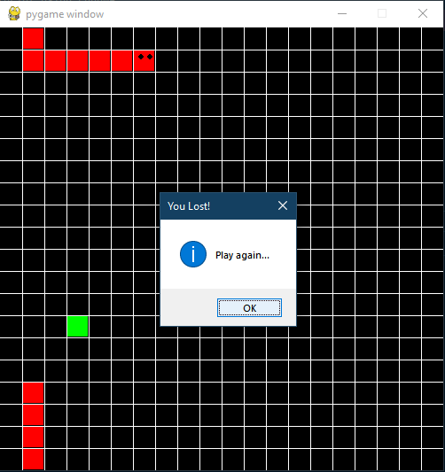
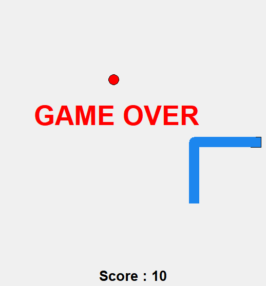
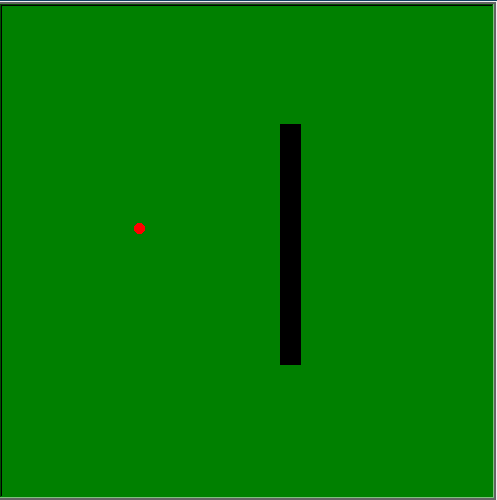

# snake-game:

Snake is the common name for a video game concept where the player maneuvers a line which grows in length, with the line itself being a primary obstacle.

 

## 1. PyGame

 

## 2. Tkinter

 

## 3. Turtle

